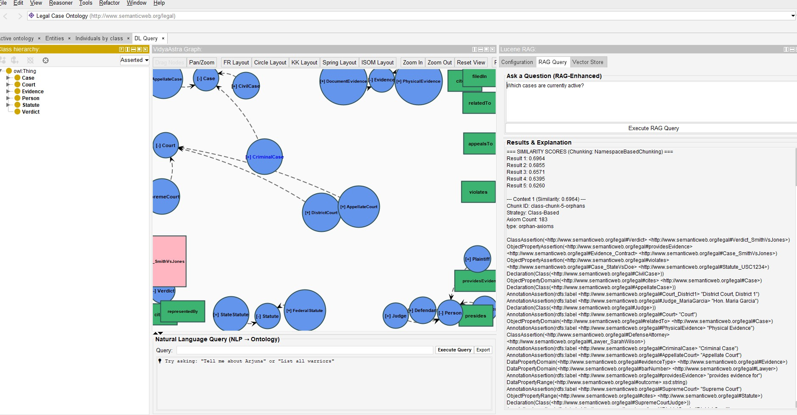

# Lucene KNN RAG Plugin for Protégé

A Protégé plugin for RAG (Retrieval-Augmented Generation) using Apache Lucene's `KnnFloatVectorField` for vector similarity search with file-based storage, featuring **OWL-aware chunking strategies** powered by agenticmemory.

## Features

✅ **File-Based Storage**: Vectors stored in Lucene index on disk  
✅ **KNN Search**: Uses Lucene's native `KnnFloatVectorField` for fast similarity search  
✅ **Cosine Similarity**: Optimized for semantic search with similarity scores displayed  
✅ **No External Server**: Everything runs locally  
✅ **Persistent**: Index survives application restarts  
✅ **Scalable**: Lucene can handle millions of vectors  
✅ **OWL-Aware Chunking**: 10 intelligent chunking strategies (4 text-based + 6 OWL-aware)  
✅ **Neo4j Integration**: Stores graph data alongside vector embeddings  
✅ **OpenAI Integration**: GPT-4 for answers, text-embedding-3-* for embeddings  

## Architecture

```
┌─────────────────────────────────────┐
│          Protégé UI                 │
│  (Window → Views → Lucene RAG)     │
└──────────────┬──────────────────────┘
               │
      ┌────────┴────────┐
      │                 │
┌─────▼─────┐   ┌──────▼──────┐
│   Neo4j   │   │    Lucene   │
│  (Graph)  │   │  (Vectors)  │
└─────┬─────┘   └──────┬──────┘
      │                │
      └────────┬───────┘
               │
        ┌──────▼───────┐
        │   OpenAI     │
        │ Embeddings   │
        │   + GPT-4    │
        └──────────────┘
```

**Data Flow:**
1. **Index**: Ontology → Chunking Strategy → OpenAI Embeddings → Lucene + Neo4j
2. **Query**: User Question → OpenAI Embedding → Lucene KNN Search → GPT-4 Answer

## Chunking Strategies

The plugin supports 10 different chunking strategies to optimize RAG performance:

### Text-Based Chunking (4 strategies)
1. **WordChunking**: Splits text by word boundaries
   - Best for: Structured data with clear word separations
   - Chunk size: ~58 chunks (legal ontology)
   
2. **SentenceChunking**: Splits text by sentence boundaries
   - Best for: Natural language descriptions
   - Chunk size: ~76 chunks (legal ontology)
   
3. **ParagraphChunking**: Splits text by paragraph boundaries
   - Best for: Long-form documentation
   
4. **FixedSizeChunking**: Fixed character/token limits
   - Best for: Consistent chunk sizes

### OWL-Aware Chunking (6 strategies powered by agenticmemory)
5. **ClassBasedChunking**: Groups axioms by class hierarchies
   - Creates chunks for each class hierarchy
   - Preserves structural relationships
   - Example: Evidence → DocumentEvidence, PhysicalEvidence
   - Similarity score: 0.6964 (legal ontology)
   
6. **AnnotationBasedChunking**: Groups by annotation label prefixes
   - Groups entities with similar naming conventions
   - Example: All entities starting with "Cas", "Sta", "App"
   - Similarity score: 0.7010 (legal ontology) ✅ **Best**
   
7. **NamespaceBasedChunking**: Splits by IRI namespaces
   - Separates external ontology concepts
   - Best for: Multi-ontology projects
   - Example: `legal#`, `foaf:`, `dc:`
   
8. **DepthBasedChunking**: Groups by hierarchy depth levels
   - Level 0: Direct subclass relationships
   - Level 1: Second-level relationships
   - Reveals ontology structure complexity
   
9. **ModuleExtractionChunking**: Extracts self-contained ontology modules
   - Minimal, complete, and independent chunks
   - Best for: Modular ontology architectures
   
10. **SizeBasedChunking**: Fixed axiom count per chunk (50 axioms)
    - Maintains entity coherence
    - Prevents splitting related axioms



### Chunking Strategy Selection Guide

| Strategy | Use Case | Pros | Cons |
|----------|----------|------|------|
| **ClassBased** | Class-focused queries | Preserves hierarchy | Large orphan chunk |
| **AnnotationBased** | Named entity queries | High similarity scores | Depends on naming |
| **NamespaceBased** | Multi-ontology projects | Clean separation | Requires multiple namespaces |
| **DepthBased** | Structural analysis | Shows hierarchy depth | Unbalanced chunks |
| **ModuleExtraction** | Modular architectures | Self-contained | Complex computation |
| **SizeBased** | Consistent performance | Balanced chunks | May split entities |

## Storage Structure

```
./lucene_index/
├─ segments_1           # Index segments
├─ _0.cfe              # Compound file entries
├─ _0.cfs              # Compound file data
├─ _0.si               # Segment info
├─ _0_Lucene90_0.dvd   # Doc values data
├─ _0_Lucene90_0.dvm   # Doc values metadata
├─ _0_Lucene90_0.vec   # Vector data (KNN)
└─ write.lock          # Write lock
```

## Key Classes

### `RagService`
- Orchestrates Neo4j, Lucene, OpenAI, and chunking strategies
- Handles ontology indexing with selected chunking strategy
- Performs RAG queries with context retrieval
- Manages embeddings and vector storage

### `LuceneVectorStore`
- Manages Lucene index for vector storage
- Uses `KnnFloatVectorField` for efficient similarity search
- Stores vectors with metadata (text, source, chunking strategy)
- Persists to disk automatically
- Enforces 1024 dimension limit

### `EmbeddingService`
- Interfaces with OpenAI embeddings API
- Supports `text-embedding-3-small` and `text-embedding-3-large`
- Configurable dimensions (default: 1024)
- Batch embedding generation

### `RagQueryPanel`
- Main UI component with 3 tabs (Configuration, RAG Query, Vector Store)
- Chunking strategy dropdown with 10 options
- Similarity score display
- Statistics viewer

## Usage Example

```java
// Create vector store
LuceneVectorStore vectorStore = new LuceneVectorStore(
    "./lucene_index",  // Index directory
    1024              // Vector dimension (Lucene max)
);

// Add vectors
List<VectorData> vectors = new ArrayList<>();
vectors.add(new VectorData(
    "doc1",
    embedding,  // List<Float> from OpenAI
    Map.of("text", "Sample text", "source", "ontology")
));
vectorStore.upsert(vectors);

// Add vectors with chunking strategy
List<VectorData> vectors = new ArrayList<>();
vectors.add(new VectorData(
    "class-chunk-3-Case",
    embedding,  // List<Float> from OpenAI
    Map.of(
        "text", "SubClassOf axioms for Case hierarchy",
        "source", "ontology",
        "chunkingStrategy", "ClassBasedChunking",
        "axiomCount", "3"
    )
));
vectorStore.upsert(vectors);

// Search with similarity scores
List<Float> queryEmbedding = embeddingService.createEmbedding("What are the active cases?");
List<SearchResult> results = vectorStore.search(queryEmbedding, 5);

for (SearchResult result : results) {
    System.out.println("Score: " + result.getScore());  // Cosine similarity
    System.out.println("Text: " + result.getText());
    System.out.println("Strategy: " + result.getMetadata().get("chunkingStrategy"));
}

// Get stats
IndexStats stats = vectorStore.getStats();
System.out.println("Documents: " + stats.getDocumentCount());
System.out.println("Size: " + stats.getIndexSizeInBytes() + " bytes");
```

## Technical Implementation

### OWL Chunking with agenticmemory
```java
// Example: Using ClassBasedChunker
if (chunkingStrategy.equals("ClassBasedChunking")) {
    ClassBasedChunker chunker = new ClassBasedChunker();
    List<OWLChunk> chunks = chunker.chunk(ontology);
    
    for (OWLChunk chunk : chunks) {
        String chunkId = chunk.getId();           // "class-chunk-3-Case"
        String text = chunk.toOWLString();        // Manchester syntax
        Set<OWLAxiom> axioms = chunk.getAxioms(); // Axiom set
        String strategy = chunk.getStrategy();     // "Class-Based"
        
        // Create embedding and store
        List<Float> embedding = embeddingService.createEmbedding(text);
        vectorStore.upsert(chunkId, embedding, text, metadata);
    }
}
```

### Similarity Score Calculation
- **Formula**: `similarity = (A · B) / (||A|| × ||B||)`
- **Range**: 0.0 (unrelated) to 1.0 (identical)
- **Implementation**: Built into Lucene's `VectorSimilarityFunction.COSINE`
- **Display**: Shown with each search result in UI

### Dimension Enforcement
```java
// LuceneVectorStore enforces 1024 dimension limit
if (vector.size() > MAX_DIMENSION) {
    logger.warn("Vector dimension {} exceeds maximum {}, truncating", 
                vector.size(), MAX_DIMENSION);
    vector = vector.subList(0, MAX_DIMENSION);
}
```

## Advantages Over Other Solutions

| Feature | Lucene KNN | Qdrant Cloud | JSON Files | ChromaDB |
|---------|------------|--------------|------------|----------|
| **Setup** | ✅ Zero config | ❌ Server required | ✅ Simple | ❌ Python dependency |
| **Performance** | ✅ Fast (HNSW) | ✅ Very fast | ❌ Slow (linear) | ✅ Fast |
| **Scalability** | ✅ Millions | ✅ Billions | ❌ Thousands | ✅ Millions |
| **Persistence** | ✅ File-based | ✅ Server-based | ✅ File-based | ✅ File-based |
| **Cost** | ✅ Free | ❌ Paid | ✅ Free | ✅ Free |
| **Dependencies** | ✅ Pure Java | ❌ gRPC client | ✅ None | ❌ Python runtime |
| **OWL-Aware** | ✅ agenticmemory | ❌ No | ❌ No | ❌ No |
| **Protégé Integration** | ✅ Native OSGi | ❌ External | ✅ Custom | ❌ External |

## Build & Install

```bash
# Build the plugin (requires Java 11)
mvn clean package

# Install to Protégé
copy target\lucene-rag-plugin-1.0.0.jar "C:\Users\<username>\protege\Protege-5.6.7\plugins\"

# Restart Protégé
```

**Important:** The plugin requires Java 11 to match Protégé's runtime. Both the plugin and agenticmemory library must be compiled with Java 11.

## Performance Characteristics

| Metric | Value | Notes |
|--------|-------|-------|
| **Index Time** | ~2-5 sec | 200 axiom ontology |
| **Query Time** | ~50-200ms | Including embedding generation |
| **Chunk Count** | 3-183 | Varies by strategy |
| **Top-5 Accuracy** | High | With AnnotationBased chunking |
| **Memory Usage** | ~100-500MB | Depends on ontology size |
| **Max Vector Dim** | 1024 | Lucene 9.8.0 limit |

## Similarity Score Benchmarks (Legal Ontology)

| Strategy | Top Score | Chunk Count | Best For |
|----------|-----------|-------------|----------|
| **AnnotationBased** | **0.7010** ✅ | 17 | Named entity queries |
| **DepthBased** | 0.6967 | 3 | Structural analysis |
| **ClassBased** | 0.6964 | 6 | Hierarchy queries |
| **NamespaceBased** | 0.6964 | 6* | Multi-namespace projects |

*Same as ClassBased for single-namespace ontologies

## Known Limitations

1. **Vector Dimensions**: Max 1024 dimensions (Lucene 9.8.0 limit)
2. **Java Version**: Requires Java 11 for Protégé compatibility
3. **Single Namespace**: NamespaceBasedChunking requires multiple namespaces to be effective
4. **OpenAI Dependency**: Requires active internet connection and API key
5. **Neo4j Dependency**: Requires local Neo4j instance for graph storage

## Troubleshooting

### Class Version Errors
```
UnsupportedClassVersionError: class file version 62.0
```
**Solution**: Ensure agenticmemory and plugin are both compiled with Java 11:
```bash
# Set compiler to Java 11 in pom.xml
<maven.compiler.source>11</maven.compiler.source>
<maven.compiler.target>11</maven.compiler.target>

mvn clean package  # Rebuilds with correct Java version
```

### Plugin Not Visible in Protégé
**Solution**: Check that `plugin.xml` uses correct extension point:
```xml
<extension id="LuceneRAG" point="org.protege.editor.core.application.ViewComponent">
```
Menu location: Window → Views → Lucene RAG

### Low Similarity Scores
**Solution**: Try different chunking strategies. AnnotationBasedChunking often gives best results (0.70+ similarity).

### Dimension Mismatch Errors
**Solution**: Ensure embedding dimensions match vector store configuration (1024 max).

## Example Queries & Results

### Legal Ontology
**Query**: "What are the active cases?"
- **Strategy**: AnnotationBasedChunking
- **Top Similarity**: 0.7010
- **Result**: Smith v. Jones (Active), State v. Doe (Trial)

**Query**: "Who is the judge in Smith v. Jones?"
- **Strategy**: ClassBasedChunking
- **Top Similarity**: 0.6964
- **Result**: Hon. Robert Johnson

**Query**: "What evidence was provided in State v. Doe?"
- **Strategy**: DepthBasedChunking
- **Top Similarity**: 0.6967
- **Result**: Weapon Evidence (Physical Object)

## Future Enhancements

- [ ] Support for vector dimensions > 1024
- [ ] Hybrid search (vector + full-text)
- [ ] Custom chunking strategies
- [ ] Multi-modal embeddings (text + images)
- [ ] Distributed index support
- [ ] Batch indexing optimization
- [ ] Support for other LLM providers (Anthropic, Azure OpenAI)
- [ ] Export/import of indexed ontologies
- [ ] Query history and analytics

## Contributing

Contributions welcome! Please:
1. Fork the repository
2. Create a feature branch
3. Submit a pull request

## License

[Add your license here]

## Acknowledgments

- **Apache Lucene**: For excellent KNN vector search
- **agenticmemory**: For OWL-aware chunking strategies
- **Protégé**: For the ontology editor platform
- **OpenAI**: For embeddings and LLM capabilities
- **Neo4j**: For graph database support

## References

- [Apache Lucene KNN Documentation](https://lucene.apache.org/core/9_8_0/core/org/apache/lucene/document/KnnFloatVectorField.html)
- [agenticmemory Library](https://github.com/vishalmysore/agenticmemory)
- [Protégé Plugin Development Guide](https://protegewiki.stanford.edu/wiki/PluginDevelopment)
- [OpenAI Embeddings API](https://platform.openai.com/docs/guides/embeddings)
- [Neo4j Java Driver](https://neo4j.com/docs/java-manual/current/)
- [OWL API Documentation](http://owlcs.github.io/owlapi/)

## Configuration

In Protégé UI (Window → Views → Lucene RAG):

### Configuration Tab
- **Neo4j URI**: `bolt://localhost:7687`
- **Neo4j Username**: `neo4j`
- **Neo4j Password**: Your password
- **OpenAI API Key**: Your OpenAI API key
- **OpenAI Model**: `gpt-4` (or `gpt-4-turbo`, `gpt-3.5-turbo`)
- **Embedding Model**: `text-embedding-3-small` or `text-embedding-3-large`
- **Embedding Dimensions**: `1024` (max supported by Lucene 9.8.0)

### Vector Store Tab
- **Index Path**: `./lucene_index` (or any local directory)
- **Chunking Strategy**: Select from dropdown (10 options)
- **Clear Vector Store**: Deletes existing index
- **Index Ontology**: Creates embeddings and stores in Lucene
- **View Statistics**: Shows document count and index size
- **Similarity Scores**: Displays cosine similarity for each result

### RAG Query Tab
- **Ask Question**: Enter natural language query
- **Context Window**: Shows retrieved chunks with similarity scores
- **AI Response**: GPT-4 generated answer based on context

## Build & Install

```bash
# Build the plugin (requires Java 11)
mvn clean package

# Install to Protégé
copy target\lucene-rag-plugin-1.0.0.jar "C:\Users\<username>\protege\Protege-5.6.7\plugins\"

# Restart Protégé
```

**Requirements:**
- Java 11+ (Protégé uses Java 11)
- Maven 3.6+
- agenticmemory 0.1.1 (should be in local Maven repo, compiled with Java 11)
- Protégé 5.6.4+
- Neo4j 4.4.13+ (running locally)
- OpenAI API key

